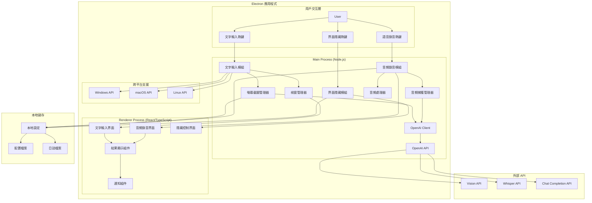
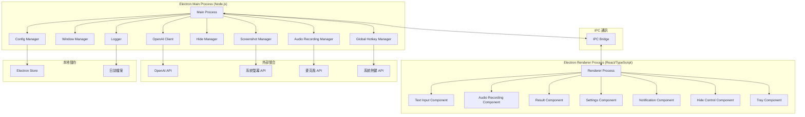

# Design Document

## Overview

Ghost AI 是一個基於 Electron 和 TypeScript 的跨平台智能桌面助手系統，提供三個核心功能模組：文字輸入與螢幕分析、語音錄音處理、以及隱藏式界面管理。系統採用純前端架構，無需任何後端服務，直接整合 OpenAI API，通過事件驅動和全域熱鍵系統實現無縫操作。所有API設定（包括金鑰、基礎URL、模型選擇）都可在前端界面中配置和管理。支援多模態AI交互和自定義提示詞管理，可打包為 Windows、macOS 和 Linux 的原生桌面應用程式。整個系統設計重點在於隱私保護、跨平台相容性、使用者體驗和系統穩定性。

## Architecture

### 系統架構圖



### 技術棧選擇

**核心技術棧 (TypeScript/Electron)**

- **Electron**: 跨平台桌面應用框架，提供系統級 API 存取和原生應用打包
- **TypeScript**: 型別安全的 JavaScript 超集，提供更好的開發體驗和程式碼品質
- **React**: 用於 Renderer Process 的 UI 組件開發
- **Node.js**: Main Process 的執行環境，處理系統級操作

**系統整合套件**

- **node-global-key-listener**: 實作跨平台全域熱鍵監聽
- **electron-screenshot-desktop**: 處理跨平台螢幕截圖功能
- **node-record-lpcm16**: 音頻錄音和處理功能
- **electron-window-state**: 視窗狀態管理和隱藏功能
- **electron-store**: 本地設定和數據持久化

**AI 整合**

- **openai**: OpenAI 官方 JavaScript SDK，直接呼叫 Vision、Whisper 和 Chat Completion API
- **axios**: HTTP 客戶端，用於 API 通訊和錯誤處理

**開發工具**

- **electron-builder**: 跨平台應用程式打包和分發
- **webpack**: 模組打包和建置工具
- **jest**: 單元測試框架
- **eslint**: 程式碼品質檢查
- **prettier**: 程式碼格式化

## Components and Interfaces

### Electron 應用程式架構



#### 1. Global Hotkey Manager

```typescript
interface GlobalHotkeyManager {
  registerTextInputHotkey(combination: string): Promise<void>;
  registerAudioRecordHotkey(combination: string): Promise<void>;
  registerHideToggleHotkey(combination: string): Promise<void>;
  unregisterAllHotkeys(): Promise<void>;
  onTextInputTriggered(callback: () => void): void;
  onAudioRecordTriggered(callback: () => void): void;
  onHideToggleTriggered(callback: () => void): void;
  isHotkeyConflict(combination: string): boolean;
}
```

#### 2. Window Manager

```typescript
interface WindowManager {
  hideAllWindows(): Promise<void>;
  showTextInputWindow(): Promise<void>;
  showAudioRecordingWindow(): Promise<void>;
  showResultWindow(): Promise<void>;
  toggleVisibility(): Promise<void>;
  setWindowInvisible(windowId: string): Promise<void>;
  isWindowVisible(windowId: string): boolean;
  isAppHidden(): boolean;
}
```

#### 3. Screenshot Manager

```typescript
interface ScreenshotManager {
  captureScreen(): Promise<Buffer>;
  captureActiveWindow(): Promise<Buffer>;
  captureRegion(x: number, y: number, width: number, height: number): Promise<Buffer>;
  captureWithDelay(delayMs: number): Promise<Buffer>;
}
```

#### 4. Audio Recording Manager

```typescript
interface AudioRecordingManager {
  startRecording(): Promise<string>; // returns recording ID
  stopRecording(recordingId: string): Promise<Buffer>;
  isRecording(): boolean;
  getRecordingDuration(recordingId: string): number;
  cancelRecording(recordingId: string): Promise<void>;
  getAudioDevices(): Promise<AudioDevice[]>;
  setAudioDevice(deviceId: string): Promise<void>;
}

interface AudioDevice {
  id: string;
  name: string;
  isDefault: boolean;
  type: 'input' | 'output';
}
```

#### 5. OpenAI Client (./src/shared/openai-client.ts)

```typescript
interface OpenAIClient {
  // 基礎配置 - 從前端設定中動態載入
  initialize(config: OpenAIConfig): void;
  updateConfig(config: Partial<OpenAIConfig>): void;
  validateConfig(config: OpenAIConfig): Promise<boolean>;
  
  // 圖片分析 API (Vision)
  analyzeImageWithText(imageBuffer: Buffer, textPrompt: string, customPrompt: string): Promise<AnalysisResult>;
  analyzeImageBase64(imageBase64: string, textPrompt: string, customPrompt: string): Promise<AnalysisResult>;
  
  // 音頻處理 API (Whisper)
  transcribeAudio(audioBuffer: Buffer): Promise<TranscriptionResult>;
  transcribeAudioBase64(audioBase64: string): Promise<TranscriptionResult>;
  
  // Chat Completion API
  chatCompletion(messages: ChatMessage[], model?: string): Promise<ChatCompletionResult>;
  
  // 模型管理
  listAvailableModels(): Promise<ModelInfo[]>;
  
  // 錯誤處理
  handleApiError(error: any): Promise<ErrorResponse>;
  retry<T>(operation: () => Promise<T>, maxRetries: number): Promise<T>;
}

interface OpenAIConfig {
  apiKey: string;
  baseURL: string;
  model: string;
  timeout: number;
  maxTokens: number;
  temperature: number;
}

interface ModelInfo {
  id: string;
  name: string;
  description: string;
  capabilities: string[];
}

interface ChatMessage {
  role: 'system' | 'user' | 'assistant';
  content: string | Array<{
    type: 'text' | 'image_url';
    text?: string;
    image_url?: {
      url: string;
      detail?: 'low' | 'high' | 'auto';
    };
  }>;
}

interface ChatCompletionResult {
  requestId: string;
  content: string;
  model: string;
  usage: {
    prompt_tokens: number;
    completion_tokens: number;
    total_tokens: number;
  };
  timestamp: string;
}

interface UploadResponse {
  requestId: string;
  uploadUrl?: string;
  status: 'uploaded' | 'processing' | 'completed' | 'error';
}

interface HealthStatus {
  status: 'healthy' | 'unhealthy';
  version: string;
  uptime: number;
}

interface AudioAnalysisResult {
  requestId: string;
  transcription: string;
  analysis: string;
  confidence: number;
  duration: number;
  timestamp: string;
}

interface TranscriptionResult {
  requestId: string;
  text: string;
  confidence: number;
  language: string;
  duration: number;
  timestamp: string;
}
```

### 核心服務模組

#### 1. 圖片處理服務 (./src/services/image-processor.ts)

```typescript
class ImageProcessor {
  validateImage(imageBuffer: Buffer): boolean {
    // 驗證圖片格式和大小
  }

  optimizeImage(imageBuffer: Buffer): Buffer {
    // 最佳化圖片大小以符合 API 限制
  }

  cleanMetadata(imageBuffer: Buffer): Buffer {
    // 清除圖片中的敏感元資料
  }

  convertToBase64(imageBuffer: Buffer): string {
    // 轉換為 base64 格式供 API 使用
  }
}
```

#### 2. 音頻處理服務 (./src/services/audio-processor.ts)

```typescript
class AudioProcessor {
  validateAudio(audioBuffer: Buffer): boolean {
    // 驗證音頻格式和大小
  }

  convertAudioFormat(audioBuffer: Buffer, targetFormat: string): Buffer {
    // 轉換音頻格式
  }

  reduceNoise(audioBuffer: Buffer): Buffer {
    // 降噪處理
  }

  normalizeVolume(audioBuffer: Buffer): Buffer {
    // 音量正規化
  }

  cleanAudioMetadata(audioBuffer: Buffer): Buffer {
    // 清除音頻中的敏感元資料
  }

  prepareForWebRTC(audioStream: Buffer): Promise<any> {
    // 為未來WebRTC功能準備音頻流
  }
}
```

## Data Models

### 應用程式資料模型

```typescript
interface TextInputRequest {
  imageBuffer: Buffer;
  textPrompt: string;
  customPrompt: string;
  timestamp: number;
  requestId: string;
}

interface AudioRecordingRequest {
  audioBuffer: Buffer;
  duration: number;
  timestamp: number;
  requestId: string;
}

interface AnalysisResult {
  requestId: string;
  result: string;
  timestamp: number;
  status: 'pending' | 'completed' | 'error';
  type: 'text_image' | 'audio';
  error?: string;
}

interface UserSettings {
  textInputHotkey: string;
  audioRecordHotkey: string;
  hideToggleHotkey: string;
  defaultPrompt: string;
  autoHide: boolean;
  privacyMode: boolean;
  audioDevice: string;
  rememberHideState: boolean;
  openaiConfig: OpenAIConfig;
  isFirstRun: boolean;
}

interface AppState {
  isVisible: boolean;
  isHidden: boolean;
  isRecording: boolean;
  isConfigured: boolean;
  currentTextRequest?: TextInputRequest;
  currentAudioRequest?: AudioRecordingRequest;
  analysisHistory: AnalysisResult[];
  settings: UserSettings;
}

interface HotkeyConfig {
  textInput: string;
  audioRecord: string;
  hideToggle: string;
}

interface WindowState {
  isVisible: boolean;
  isHidden: boolean;
  position: { x: number; y: number };
  size: { width: number; height: number };
}
```

### 配置和元資料模型

```typescript
interface ImageMetadata {
  size: number;
  format: string;
  dimensions: { width: number; height: number };
  isValid: boolean;
}

interface AudioMetadata {
  size: number;
  format: string;
  duration: number;
  sampleRate: number;
  channels: number;
  isValid: boolean;
}

interface ElectronBuildConfig {
  appId: string;
  productName: string;
  directories: {
    output: string;
    buildResources: string;
  };
  files: string[];
  mac: {
    category: string;
    target: string[];
  };
  win: {
    target: string[];
  };
  linux: {
    target: string[];
  };
}
```

## Error Handling

### 錯誤處理策略

1. **熱鍵註冊失敗**

    - 自動嘗試替代熱鍵組合
    - 提示使用者手動選擇其他組合
    - 記錄錯誤但不中斷應用程式運行

2. **截圖失敗**

    - 重試機制（最多 3 次）
    - 降級到視窗截圖模式
    - 顯示友善的錯誤訊息

3. **網路連線問題**

    - 自動重試機制
    - 離線模式提示
    - 快取請求以供稍後重試

4. **OpenAI API 錯誤**

    - 指數退避重試機制
    - API 配額管理和使用量監控
    - 降級到簡化分析模式

5. **跨平台相容性錯誤**

    - 平台特定的 API 降級處理
    - 功能可用性檢測
    - 平台特定的錯誤訊息

6. **系統資源不足**

    - 記憶體使用監控和清理
    - 優雅的功能降級
    - 資源使用警告

## Testing Strategy

### 測試策略

1. **單元測試**

    - Jest + React Testing Library 測試 UI 組件
    - Jest 測試 Main Process 的服務模組
    - Mock Electron API 和系統呼叫
    - Mock OpenAI API 回應

2. **整合測試**

    - 測試 Main Process 和 Renderer Process 的 IPC 通訊
    - 熱鍵功能測試
    - 截圖功能測試
    - OpenAI API 整合測試

3. **端到端測試**

    - Spectron 或 Playwright for Electron
    - 完整使用者流程測試
    - 跨平台相容性測試 (Windows, macOS, Linux)

4. **效能測試**

    - 記憶體洩漏檢測
    - 啟動時間測試
    - API 回應時間測試
    - 跨平台效能比較

### 安全性測試

1. **隱私保護測試**

    - 驗證無磁碟儲存
    - 記憶體清理驗證
    - 網路流量分析

2. **熱鍵安全性測試**

    - 鍵盤記錄軟體偵測測試
    - 低層級鉤子功能驗證
    - 系統日誌檢查

## Security Considerations

### 隱私保護機制

1. **記憶體處理**

    - 所有圖片資料僅在記憶體中處理
    - 使用安全的記憶體清理函數
    - 避免虛擬記憶體交換

2. **網路安全**

    - HTTPS 強制加密
    - 憑證固定 (Certificate Pinning)
    - 請求標頭混淆

3. **程序隱蔽**

    - 隨機程序名稱
    - 隱藏視窗標題
    - 最小化系統足跡

### 資料保護

1. **暫存資料管理**

    - 自動清理機制
    - 加密暫存資料
    - 定期記憶體掃描

2. **API 金鑰保護**

    - 本地加密儲存（使用 Electron 的 safeStorage API）
    - 執行時期記憶體加密
    - 前端設定界面的安全輸入
    - 設定匯出時的敏感資料過濾

## Performance Optimization

### 效能最佳化

1. **應用程式啟動最佳化**

    - 延遲載入非關鍵組件
    - 預載入常用資源
    - 背景服務初始化
    - 分階段初始化系統服務

2. **記憶體使用最佳化**

    - 及時釋放圖片和音頻緩衝區
    - 組件生命週期管理
    - 垃圾回收最佳化
    - 記憶體使用監控

3. **跨平台效能最佳化**

    - 平台特定的最佳化策略
    - 原生 API 使用最佳化
    - 資源使用的平台適配

4. **API 通訊最佳化**

    - 連線池管理
    - 請求快取機制
    - 壓縮和最佳化圖片/音頻數據
    - 批次處理支援
