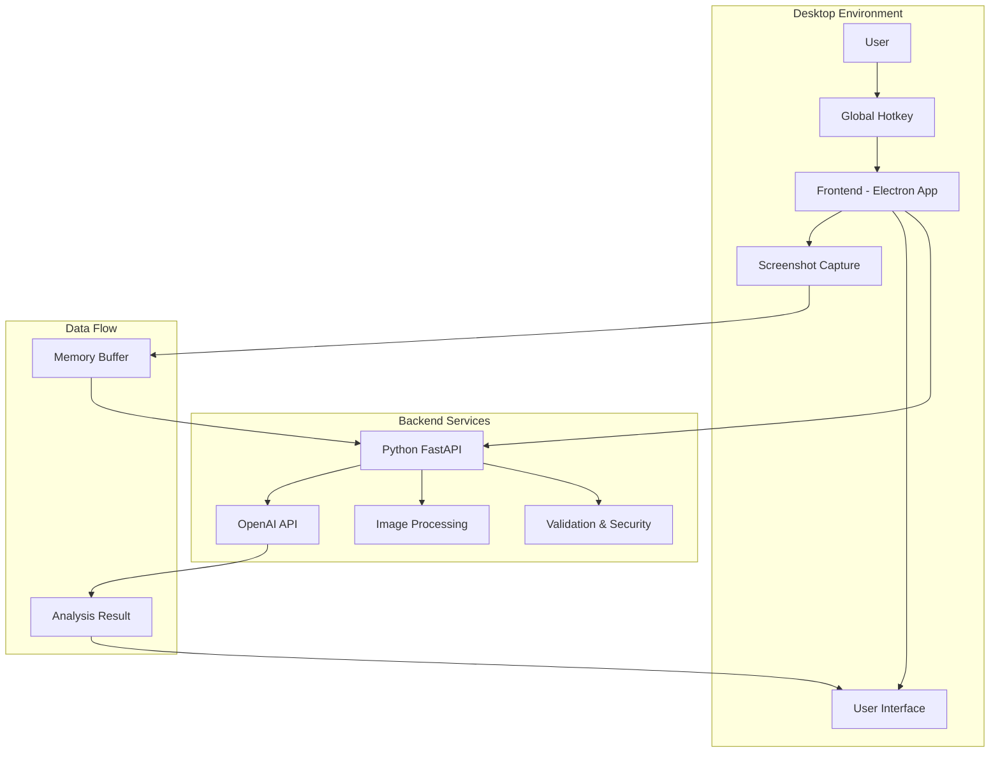
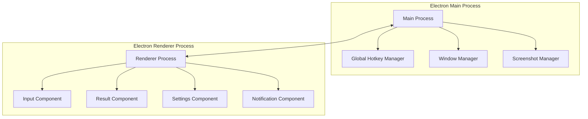
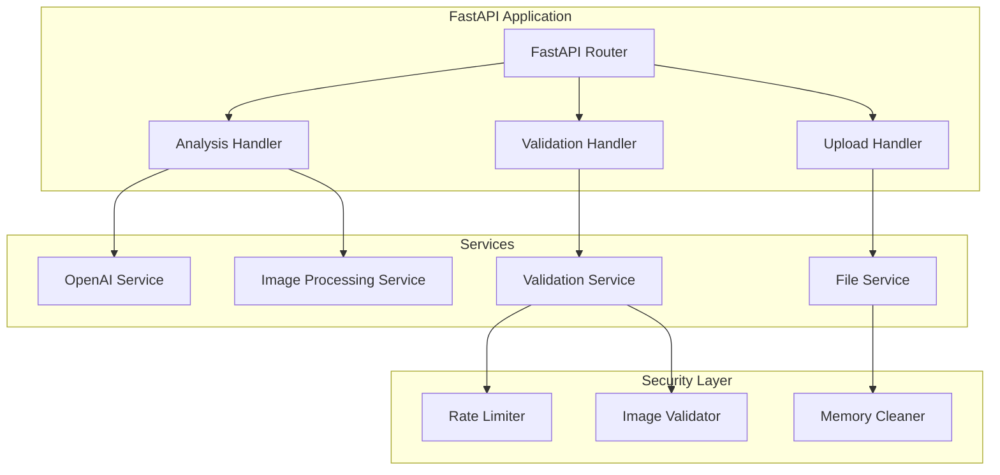

# Design Document

## Overview

Ghost AI 是一個前後端分離的桌面應用程式，由 TypeScript/Electron 前端和 Python FastAPI 後端組成。系統透過全域熱鍵觸發截圖，將圖片傳送給 OpenAI 進行分析，並在隱蔽的介面中顯示結果。整個系統設計重點在於隱私保護、使用者體驗和系統穩定性。

## Architecture

### 系統架構圖



### 技術棧選擇

**前端 (TypeScript/Electron)**
- **Electron**: 提供跨平台桌面應用支援和系統級 API 存取
- **TypeScript**: 型別安全和更好的開發體驗
- **React**: 用於 UI 組件開發
- **node-global-key-listener**: 實作全域熱鍵監聽
- **electron-screenshot-desktop**: 處理螢幕截圖

**後端 (Python)**
- **FastAPI**: 高效能 API 框架，支援自動文件生成
- **OpenAI Python SDK**: 官方 SDK 處理圖片分析
- **Pillow**: 圖片處理和驗證
- **uvicorn**: ASGI 伺服器
- **python-multipart**: 處理檔案上傳

## Components and Interfaces

### 前端組件架構



#### 1. Global Hotkey Manager
```typescript
interface GlobalHotkeyManager {
  registerHotkey(combination: string): Promise<void>;
  unregisterHotkey(): Promise<void>;
  onHotkeyPressed(callback: () => void): void;
  isHotkeyConflict(combination: string): boolean;
}
```

#### 2. Window Manager
```typescript
interface WindowManager {
  hideAllWindows(): Promise<void>;
  showInputWindow(): Promise<void>;
  showResultWindow(): Promise<void>;
  setWindowInvisible(windowId: string): Promise<void>;
  isWindowVisible(windowId: string): boolean;
}
```

#### 3. Screenshot Manager
```typescript
interface ScreenshotManager {
  captureScreen(): Promise<Buffer>;
  captureActiveWindow(): Promise<Buffer>;
  captureRegion(x: number, y: number, width: number, height: number): Promise<Buffer>;
}
```

#### 4. API Client
```typescript
interface APIClient {
  analyzeImage(imageBuffer: Buffer, prompt: string): Promise<AnalysisResult>;
  uploadImage(imageBuffer: Buffer): Promise<string>;
  getAnalysisResult(requestId: string): Promise<AnalysisResult>;
}
```

### 後端組件架構



#### 1. Analysis Handler
```python
class AnalysisHandler:
    async def analyze_image(self, image: UploadFile, prompt: str) -> AnalysisResult:
        """處理圖片分析請求"""
        pass
    
    async def get_analysis_status(self, request_id: str) -> AnalysisStatus:
        """取得分析狀態"""
        pass
```

#### 2. OpenAI Service
```python
class OpenAIService:
    async def analyze_image_with_prompt(self, image_data: bytes, prompt: str) -> str:
        """使用 OpenAI Vision API 分析圖片"""
        pass
    
    async def handle_api_error(self, error: Exception) -> str:
        """處理 API 錯誤"""
        pass
```

#### 3. Image Processing Service
```python
class ImageProcessingService:
    def validate_image(self, image_data: bytes) -> bool:
        """驗證圖片格式和大小"""
        pass
    
    def optimize_image(self, image_data: bytes) -> bytes:
        """最佳化圖片大小以符合 API 限制"""
        pass
    
    def clean_metadata(self, image_data: bytes) -> bytes:
        """清除圖片中的敏感元資料"""
        pass
```

## Data Models

### 前端資料模型

```typescript
interface ScreenshotRequest {
  imageBuffer: Buffer;
  prompt: string;
  timestamp: number;
  requestId: string;
}

interface AnalysisResult {
  requestId: string;
  result: string;
  timestamp: number;
  status: 'pending' | 'completed' | 'error';
  error?: string;
}

interface UserSettings {
  hotkey: string;
  defaultPrompt: string;
  autoHide: boolean;
  privacyMode: boolean;
}

interface AppState {
  isVisible: boolean;
  currentRequest?: ScreenshotRequest;
  analysisHistory: AnalysisResult[];
  settings: UserSettings;
}
```

### 後端資料模型

```python
from pydantic import BaseModel
from typing import Optional
from datetime import datetime

class AnalysisRequest(BaseModel):
    prompt: str
    timestamp: datetime
    
class AnalysisResponse(BaseModel):
    request_id: str
    result: str
    timestamp: datetime
    processing_time: float

class ErrorResponse(BaseModel):
    error: str
    error_code: str
    timestamp: datetime
    
class ImageMetadata(BaseModel):
    size: int
    format: str
    dimensions: tuple[int, int]
    is_valid: bool
```

## Error Handling

### 前端錯誤處理策略

1. **熱鍵註冊失敗**
   - 自動嘗試替代熱鍵組合
   - 提示使用者手動選擇其他組合
   - 記錄錯誤但不中斷應用程式運行

2. **截圖失敗**
   - 重試機制（最多 3 次）
   - 降級到視窗截圖模式
   - 顯示友善的錯誤訊息

3. **網路連線問題**
   - 自動重試機制
   - 離線模式提示
   - 快取請求以供稍後重試

### 後端錯誤處理策略

1. **OpenAI API 錯誤**
   - 指數退避重試機制
   - API 配額管理
   - 降級到簡化分析模式

2. **圖片處理錯誤**
   - 格式轉換嘗試
   - 大小調整和壓縮
   - 詳細的錯誤日誌記錄

3. **系統資源不足**
   - 請求佇列管理
   - 記憶體使用監控
   - 優雅的服務降級

## Testing Strategy

### 前端測試

1. **單元測試**
   - Jest + React Testing Library
   - 測試各個組件的功能
   - Mock Electron API 和系統呼叫

2. **整合測試**
   - 測試前後端 API 整合
   - 熱鍵功能測試
   - 截圖功能測試

3. **端到端測試**
   - Playwright 或 Spectron
   - 完整使用者流程測試
   - 跨平台相容性測試

### 後端測試

1. **單元測試**
   - pytest 框架
   - 測試各個服務組件
   - Mock OpenAI API 回應

2. **API 測試**
   - FastAPI TestClient
   - 測試所有 API 端點
   - 錯誤處理測試

3. **效能測試**
   - 負載測試
   - 記憶體洩漏檢測
   - API 回應時間測試

### 安全性測試

1. **隱私保護測試**
   - 驗證無磁碟儲存
   - 記憶體清理驗證
   - 網路流量分析

2. **熱鍵安全性測試**
   - 鍵盤記錄軟體偵測測試
   - 低層級鉤子功能驗證
   - 系統日誌檢查

## Security Considerations

### 隱私保護機制

1. **記憶體處理**
   - 所有圖片資料僅在記憶體中處理
   - 使用安全的記憶體清理函數
   - 避免虛擬記憶體交換

2. **網路安全**
   - HTTPS 強制加密
   - 憑證固定 (Certificate Pinning)
   - 請求標頭混淆

3. **程序隱蔽**
   - 隨機程序名稱
   - 隱藏視窗標題
   - 最小化系統足跡

### 資料保護

1. **暫存資料管理**
   - 自動清理機制
   - 加密暫存資料
   - 定期記憶體掃描

2. **API 金鑰保護**
   - 環境變數儲存
   - 執行時期加密
   - 存取權限控制

## Performance Optimization

### 前端效能

1. **啟動時間最佳化**
   - 延遲載入非關鍵組件
   - 預載入常用資源
   - 背景服務初始化

2. **記憶體使用最佳化**
   - 及時釋放圖片緩衝區
   - 組件生命週期管理
   - 垃圾回收最佳化

### 後端效能

1. **圖片處理最佳化**
   - 非同步處理管道
   - 圖片壓縮演算法
   - 批次處理支援

2. **API 回應最佳化**
   - 連線池管理
   - 請求快取機制
   - 回應壓縮