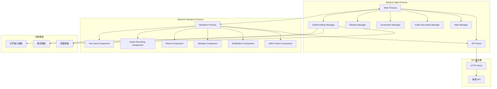
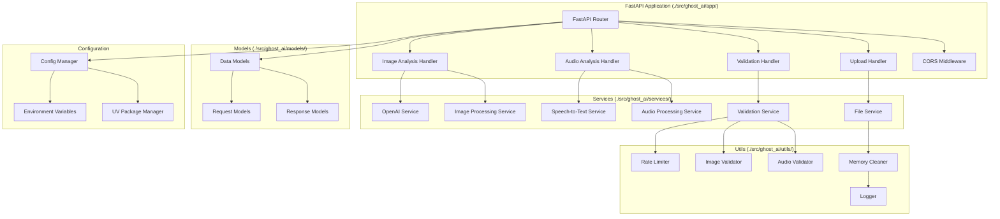

# Design Document

## Overview

Ghost AI 是一個智能桌面助手系統，提供三個核心功能模組：文字輸入與螢幕分析、語音錄音處理、以及隱藏式界面管理。系統採用事件驅動架構，通過全域熱鍵系統實現無縫操作，支援多模態AI交互和自定義提示詞管理。整個系統設計重點在於隱私保護、使用者體驗和系統穩定性。

## Architecture

### 系統架構圖

```mermaid
graph TB
    subgraph "前端應用 (./frontend/)"
        subgraph "用戶交互層"
            U[User] --> HK1[文字輸入熱鍵]
            U --> HK2[語音錄音熱鍵]
            U --> HK3[界面隱藏熱鍵]
        end

        subgraph "前端核心模組"
            HK1 --> TIM[文字輸入模組]
            HK2 --> ARM[音頻錄音模組]
            HK3 --> HIM[界面隱藏模組]
            
            TIM --> SC[螢幕截圖]
            TIM --> TI[文字輸入框]
            ARM --> AR[音頻捕獲]
            ARM --> AS[音頻處理]
        end

        subgraph "OpenAI 直接整合"
            SC --> OC[OpenAI Client]
            TI --> OC
            AR --> OC
            OC --> OAI[OpenAI API]
        end
    end

    subgraph "外部 API"
        OAI --> VISION[Vision API]
        OAI --> WHISPER[Whisper API]
        OAI --> CHAT[Chat Completion API]
    end

    subgraph "回應處理"
        VISION --> RES[分析結果]
        WHISPER --> RES
        CHAT --> RES
        RES --> UI[用戶界面]
        UI --> HIM
    end

    subgraph "後端 API (./src/ghost_ai/) - 後期擴展"
        style "後端 API (./src/ghost_ai/) - 後期擴展" fill:#f9f9f9,stroke:#ccc,stroke-dasharray: 5 5
        
        subgraph "API 處理層 (後期)"
            API[FastAPI 路由] --> IAH[圖片分析處理器]
            API --> AAH[音頻分析處理器]
            API --> UH[上傳處理器]
            API --> VH[驗證處理器]
        end

        subgraph "服務層 (後期)"
            IAH --> OAS[OpenAI 服務]
            IAH --> IPS[圖片處理服務]
            AAH --> STT[語音轉文字服務]
            AAH --> APS[音頻處理服務]
            UH --> FS[檔案服務]
            VH --> VS[驗證服務]
        end
    end
```

### 技術棧選擇

**前端 (./frontend/ - TypeScript/Electron) - 主要開發重點**

- **Electron**: 提供跨平台桌面應用支援和系統級 API 存取
- **TypeScript**: 型別安全和更好的開發體驗
- **React**: 用於 UI 組件開發
- **node-global-key-listener**: 實作全域熱鍵監聽
- **electron-screenshot-desktop**: 處理螢幕截圖
- **node-record-lpcm16**: 音頻錄音功能
- **electron-window-state**: 視窗狀態管理和隱藏功能
- **openai**: OpenAI 官方 JavaScript SDK，直接呼叫 Chat Completion API
- **axios**: HTTP 客戶端，用於 API 通訊

**後端 (./src/ghost_ai/ - Python) - 後期擴展選項**

- **FastAPI**: 高效能 API 框架，支援自動文件生成（後期實作）
- **uv**: Python 套件管理器，替代 pip 和 requirements.txt
- **OpenAI Python SDK**: 官方 SDK 處理圖片分析和語音轉文字（後期實作）
- **Pillow**: 圖片處理和驗證（後期實作）
- **pydub**: 音頻處理和格式轉換（後期實作）
- **uvicorn**: ASGI 伺服器（後期實作）
- **python-multipart**: 處理檔案上傳（後期實作）
- **whisper**: 本地語音轉文字備選方案（後期實作）

## Components and Interfaces

### 前端組件架構 (./frontend/)



#### 1. Global Hotkey Manager

```typescript
interface GlobalHotkeyManager {
  registerTextInputHotkey(combination: string): Promise<void>;
  registerAudioRecordHotkey(combination: string): Promise<void>;
  registerHideToggleHotkey(combination: string): Promise<void>;
  unregisterAllHotkeys(): Promise<void>;
  onTextInputTriggered(callback: () => void): void;
  onAudioRecordTriggered(callback: () => void): void;
  onHideToggleTriggered(callback: () => void): void;
  isHotkeyConflict(combination: string): boolean;
}
```

#### 2. Window Manager

```typescript
interface WindowManager {
  hideAllWindows(): Promise<void>;
  showTextInputWindow(): Promise<void>;
  showAudioRecordingWindow(): Promise<void>;
  showResultWindow(): Promise<void>;
  toggleVisibility(): Promise<void>;
  setWindowInvisible(windowId: string): Promise<void>;
  isWindowVisible(windowId: string): boolean;
  isAppHidden(): boolean;
}
```

#### 3. Screenshot Manager

```typescript
interface ScreenshotManager {
  captureScreen(): Promise<Buffer>;
  captureActiveWindow(): Promise<Buffer>;
  captureRegion(x: number, y: number, width: number, height: number): Promise<Buffer>;
  captureWithDelay(delayMs: number): Promise<Buffer>;
}
```

#### 4. Audio Recording Manager

```typescript
interface AudioRecordingManager {
  startRecording(): Promise<string>; // returns recording ID
  stopRecording(recordingId: string): Promise<Buffer>;
  isRecording(): boolean;
  getRecordingDuration(recordingId: string): number;
  cancelRecording(recordingId: string): Promise<void>;
  getAudioDevices(): Promise<AudioDevice[]>;
  setAudioDevice(deviceId: string): Promise<void>;
}

interface AudioDevice {
  id: string;
  name: string;
  isDefault: boolean;
  type: 'input' | 'output';
}
```

#### 5. OpenAI Client (./frontend/src/shared/openai-client.ts)

```typescript
interface OpenAIClient {
  // 基礎配置
  apiKey: string;
  baseURL: string;
  timeout: number;
  
  // 圖片分析 API (Vision)
  analyzeImageWithText(imageBuffer: Buffer, textPrompt: string, customPrompt: string): Promise<AnalysisResult>;
  analyzeImageBase64(imageBase64: string, textPrompt: string, customPrompt: string): Promise<AnalysisResult>;
  
  // 音頻處理 API (Whisper)
  transcribeAudio(audioBuffer: Buffer): Promise<TranscriptionResult>;
  transcribeAudioBase64(audioBase64: string): Promise<TranscriptionResult>;
  
  // Chat Completion API
  chatCompletion(messages: ChatMessage[], model?: string): Promise<ChatCompletionResult>;
  
  // 錯誤處理
  handleApiError(error: any): Promise<ErrorResponse>;
  retry<T>(operation: () => Promise<T>, maxRetries: number): Promise<T>;
}

interface ChatMessage {
  role: 'system' | 'user' | 'assistant';
  content: string | Array<{
    type: 'text' | 'image_url';
    text?: string;
    image_url?: {
      url: string;
      detail?: 'low' | 'high' | 'auto';
    };
  }>;
}

interface ChatCompletionResult {
  requestId: string;
  content: string;
  model: string;
  usage: {
    prompt_tokens: number;
    completion_tokens: number;
    total_tokens: number;
  };
  timestamp: string;
}

interface UploadResponse {
  requestId: string;
  uploadUrl?: string;
  status: 'uploaded' | 'processing' | 'completed' | 'error';
}

interface HealthStatus {
  status: 'healthy' | 'unhealthy';
  version: string;
  uptime: number;
}

interface AudioAnalysisResult {
  requestId: string;
  transcription: string;
  analysis: string;
  confidence: number;
  duration: number;
  timestamp: string;
}

interface TranscriptionResult {
  requestId: string;
  text: string;
  confidence: number;
  language: string;
  duration: number;
  timestamp: string;
}
```

### 後端組件架構 (./src/ghost_ai/)



#### 1. Image Analysis Handler

```python
class ImageAnalysisHandler:
    async def analyze_image_with_text(self, image: UploadFile, text_prompt: str, custom_prompt: str) -> AnalysisResult:
        """處理圖片與文字的綜合分析請求"""
        pass

    async def get_analysis_status(self, request_id: str) -> AnalysisStatus:
        """取得分析狀態"""
        pass
```

#### 2. Audio Analysis Handler

```python
class AudioAnalysisHandler:
    async def transcribe_audio(self, audio: UploadFile) -> TranscriptionResult:
        """處理音頻轉文字請求"""
        pass

    async def analyze_audio_content(self, audio: UploadFile, prompt: str) -> AudioAnalysisResult:
        """分析音頻內容並提供回應"""
        pass

    async def prepare_for_webrtc(self, audio_stream: bytes) -> dict:
        """為未來WebRTC功能準備音頻流"""
        pass
```

#### 3. OpenAI Service

```python
class OpenAIService:
    async def analyze_image_with_prompt(self, image_data: bytes, text_prompt: str, custom_prompt: str) -> str:
        """使用 OpenAI Vision API 分析圖片和文字"""
        pass

    async def transcribe_audio(self, audio_data: bytes) -> str:
        """使用 OpenAI Whisper API 轉錄音頻"""
        pass

    async def chat_completion(self, messages: list, model: str = "gpt-4") -> str:
        """處理聊天完成請求"""
        pass

    async def handle_api_error(self, error: Exception) -> str:
        """處理 API 錯誤"""
        pass
```

#### 4. Image Processing Service

```python
class ImageProcessingService:
    def validate_image(self, image_data: bytes) -> bool:
        """驗證圖片格式和大小"""
        pass

    def optimize_image(self, image_data: bytes) -> bytes:
        """最佳化圖片大小以符合 API 限制"""
        pass

    def clean_metadata(self, image_data: bytes) -> bytes:
        """清除圖片中的敏感元資料"""
        pass
```

#### 5. Audio Processing Service

```python
class AudioProcessingService:
    def validate_audio(self, audio_data: bytes) -> bool:
        """驗證音頻格式和大小"""
        pass

    def convert_audio_format(self, audio_data: bytes, target_format: str) -> bytes:
        """轉換音頻格式"""
        pass

    def reduce_noise(self, audio_data: bytes) -> bytes:
        """降噪處理"""
        pass

    def normalize_volume(self, audio_data: bytes) -> bytes:
        """音量正規化"""
        pass

    def clean_audio_metadata(self, audio_data: bytes) -> bytes:
        """清除音頻中的敏感元資料"""
        pass
```

## Data Models

### 前端資料模型

```typescript
interface TextInputRequest {
  imageBuffer: Buffer;
  textPrompt: string;
  customPrompt: string;
  timestamp: number;
  requestId: string;
}

interface AudioRecordingRequest {
  audioBuffer: Buffer;
  duration: number;
  timestamp: number;
  requestId: string;
}

interface AnalysisResult {
  requestId: string;
  result: string;
  timestamp: number;
  status: 'pending' | 'completed' | 'error';
  type: 'text_image' | 'audio';
  error?: string;
}

interface UserSettings {
  textInputHotkey: string;
  audioRecordHotkey: string;
  hideToggleHotkey: string;
  defaultPrompt: string;
  autoHide: boolean;
  privacyMode: boolean;
  audioDevice: string;
  rememberHideState: boolean;
}

interface AppState {
  isVisible: boolean;
  isHidden: boolean;
  isRecording: boolean;
  currentTextRequest?: TextInputRequest;
  currentAudioRequest?: AudioRecordingRequest;
  analysisHistory: AnalysisResult[];
  settings: UserSettings;
}

interface HotkeyConfig {
  textInput: string;
  audioRecord: string;
  hideToggle: string;
}

interface WindowState {
  isVisible: boolean;
  isHidden: boolean;
  position: { x: number; y: number };
  size: { width: number; height: number };
}
```

### 後端資料模型

```python
from pydantic import BaseModel
from typing import Optional, Literal
from datetime import datetime
from enum import Enum


class RequestType(str, Enum):
    TEXT_IMAGE = "text_image"
    AUDIO = "audio"


class TextImageAnalysisRequest(BaseModel):
    text_prompt: str
    custom_prompt: str
    timestamp: datetime
    request_type: Literal[RequestType.TEXT_IMAGE] = RequestType.TEXT_IMAGE


class AudioAnalysisRequest(BaseModel):
    duration: float
    timestamp: datetime
    request_type: Literal[RequestType.AUDIO] = RequestType.AUDIO


class AnalysisResponse(BaseModel):
    request_id: str
    result: str
    timestamp: datetime
    processing_time: float
    request_type: RequestType


class AudioTranscriptionResponse(BaseModel):
    request_id: str
    transcription: str
    confidence: float
    language: str
    duration: float
    timestamp: datetime


class ErrorResponse(BaseModel):
    error: str
    error_code: str
    timestamp: datetime
    request_id: Optional[str] = None


class ImageMetadata(BaseModel):
    size: int
    format: str
    dimensions: tuple[int, int]
    is_valid: bool


class AudioMetadata(BaseModel):
    size: int
    format: str
    duration: float
    sample_rate: int
    channels: int
    is_valid: bool


class HotkeySettings(BaseModel):
    text_input: str = "Ctrl+Shift+T"
    audio_record: str = "Ctrl+Shift+R"
    hide_toggle: str = "Ctrl+Shift+H"


class AppSettings(BaseModel):
    hotkeys: HotkeySettings
    default_prompt: str
    auto_hide: bool = True
    privacy_mode: bool = True
    audio_device: Optional[str] = None
    remember_hide_state: bool = True
```

## Error Handling

### 前端錯誤處理策略

1. **熱鍵註冊失敗**

    - 自動嘗試替代熱鍵組合
    - 提示使用者手動選擇其他組合
    - 記錄錯誤但不中斷應用程式運行

2. **截圖失敗**

    - 重試機制（最多 3 次）
    - 降級到視窗截圖模式
    - 顯示友善的錯誤訊息

3. **網路連線問題**

    - 自動重試機制
    - 離線模式提示
    - 快取請求以供稍後重試

### 後端錯誤處理策略

1. **OpenAI API 錯誤**

    - 指數退避重試機制
    - API 配額管理
    - 降級到簡化分析模式

2. **圖片處理錯誤**

    - 格式轉換嘗試
    - 大小調整和壓縮
    - 詳細的錯誤日誌記錄

3. **系統資源不足**

    - 請求佇列管理
    - 記憶體使用監控
    - 優雅的服務降級

## Testing Strategy

### 前端測試

1. **單元測試**

    - Jest + React Testing Library
    - 測試各個組件的功能
    - Mock Electron API 和系統呼叫

2. **整合測試**

    - 測試前後端 API 整合
    - 熱鍵功能測試
    - 截圖功能測試

3. **端到端測試**

    - Playwright 或 Spectron
    - 完整使用者流程測試
    - 跨平台相容性測試

### 後端測試

1. **單元測試**

    - pytest 框架
    - 測試各個服務組件
    - Mock OpenAI API 回應

2. **API 測試**

    - FastAPI TestClient
    - 測試所有 API 端點
    - 錯誤處理測試

3. **效能測試**

    - 負載測試
    - 記憶體洩漏檢測
    - API 回應時間測試

### 安全性測試

1. **隱私保護測試**

    - 驗證無磁碟儲存
    - 記憶體清理驗證
    - 網路流量分析

2. **熱鍵安全性測試**

    - 鍵盤記錄軟體偵測測試
    - 低層級鉤子功能驗證
    - 系統日誌檢查

## Security Considerations

### 隱私保護機制

1. **記憶體處理**

    - 所有圖片資料僅在記憶體中處理
    - 使用安全的記憶體清理函數
    - 避免虛擬記憶體交換

2. **網路安全**

    - HTTPS 強制加密
    - 憑證固定 (Certificate Pinning)
    - 請求標頭混淆

3. **程序隱蔽**

    - 隨機程序名稱
    - 隱藏視窗標題
    - 最小化系統足跡

### 資料保護

1. **暫存資料管理**

    - 自動清理機制
    - 加密暫存資料
    - 定期記憶體掃描

2. **API 金鑰保護**

    - 環境變數儲存
    - 執行時期加密
    - 存取權限控制

## Performance Optimization

### 前端效能

1. **啟動時間最佳化**

    - 延遲載入非關鍵組件
    - 預載入常用資源
    - 背景服務初始化

2. **記憶體使用最佳化**

    - 及時釋放圖片緩衝區
    - 組件生命週期管理
    - 垃圾回收最佳化

### 後端效能

1. **圖片處理最佳化**

    - 非同步處理管道
    - 圖片壓縮演算法
    - 批次處理支援

2. **API 回應最佳化**

    - 連線池管理
    - 請求快取機制
    - 回應壓縮
