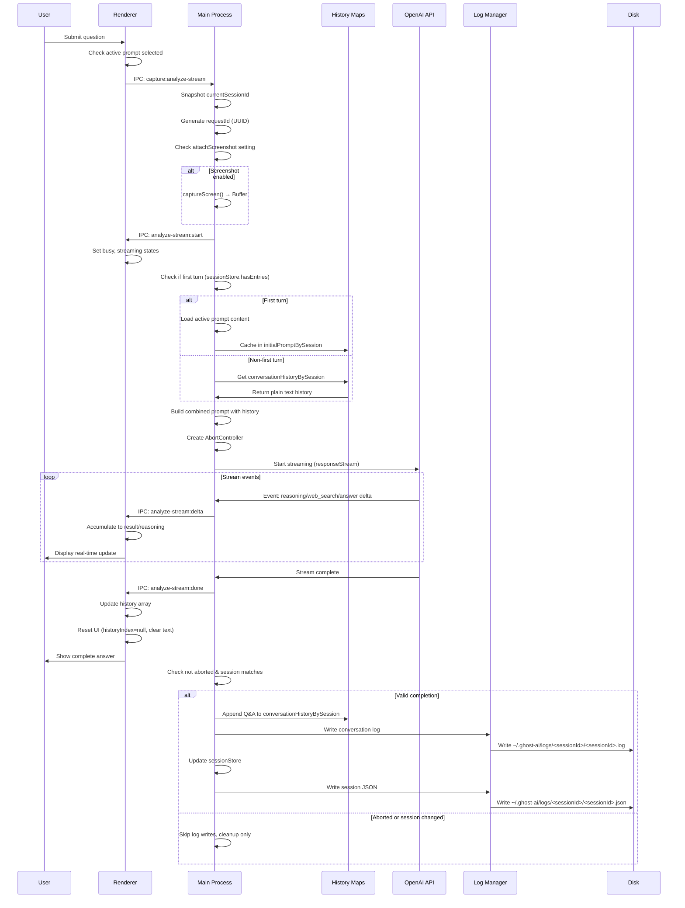
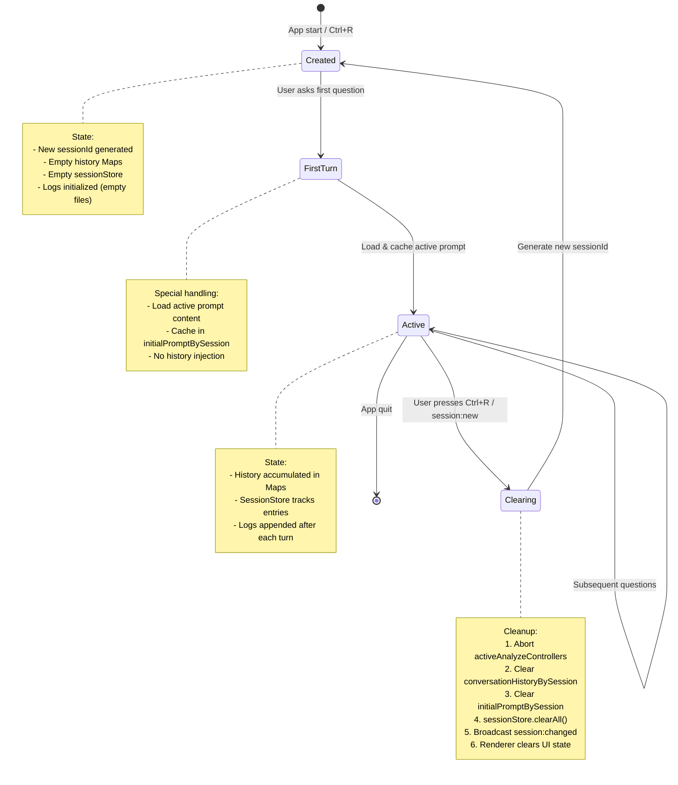
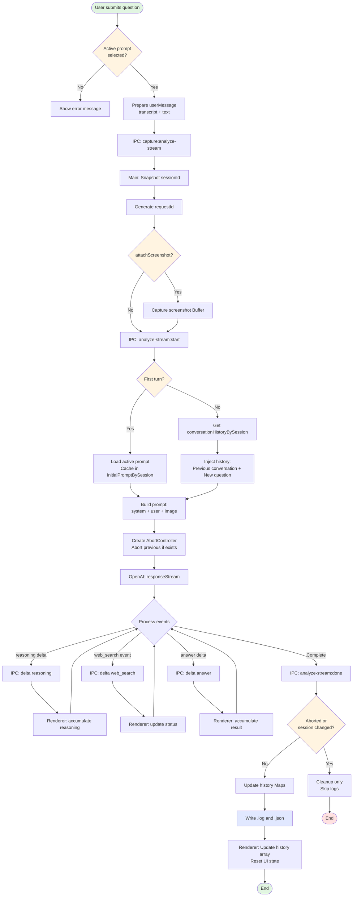

# Ghost AI Architecture Documentation

> Technical architecture documentation for Ghost AI - a privacy-first, invisible AI-powered desktop assistant.

**Last Updated:** 2025-10-12  
**Version:** 1.0.0

---

## Table of Contents

- [System Overview](#system-overview)
- [Process Model](#process-model)
- [Data Flow Architecture](#data-flow-architecture)
- [Context Management System](#context-management-system)
- [Session Lifecycle](#session-lifecycle)
- [Logging System](#logging-system)
- [Conversation Flow](#conversation-flow)
- [Key Design Decisions](#key-design-decisions)
- [Memory Management](#memory-management)
- [Error Handling & Edge Cases](#error-handling--edge-cases)

---

## System Overview

Ghost AI is built on Electron with a multi-process architecture:

```
┌─────────────────────────────────────────────────────────────┐
│                     Main Process (Node.js)                   │
│  ┌──────────────┐  ┌──────────────┐  ┌──────────────┐      │
│  │   Session    │  │  Hotkey Mgr  │  │ Screenshot   │      │
│  │   Store      │  │              │  │   Manager    │      │
│  └──────────────┘  └──────────────┘  └──────────────┘      │
│  ┌──────────────┐  ┌──────────────┐  ┌──────────────┐      │
│  │   Log Mgr    │  │ Prompts Mgr  │  │  Settings    │      │
│  └──────────────┘  └──────────────┘  └──────────────┘      │
│  ┌──────────────────────────────────────────────────┐      │
│  │      Conversation History (LRU Maps)             │      │
│  │  • conversationHistoryBySession (50 max)         │      │
│  │  • initialPromptBySession (50 max)               │      │
│  └──────────────────────────────────────────────────┘      │
└─────────────────────────────────────────────────────────────┘
                              ↕ IPC
┌─────────────────────────────────────────────────────────────┐
│                  Renderer Process (React)                    │
│  ┌──────────────────────────────────────────────────┐      │
│  │           UI State (React State)                 │      │
│  │  • history: Message[]                            │      │
│  │  • result: string                                │      │
│  │  • reasoning: string                             │      │
│  │  • historyIndex: number | null                   │      │
│  └──────────────────────────────────────────────────┘      │
│  ┌──────────────┐  ┌──────────────┐  ┌──────────────┐      │
│  │   HUDBar     │  │  AskPanel    │  │  Settings    │      │
│  └──────────────┘  └──────────────┘  └──────────────┘      │
└─────────────────────────────────────────────────────────────┘
                              ↕
┌─────────────────────────────────────────────────────────────┐
│                      OpenAI API                              │
│  • Chat Completions (gpt-4o, etc.)                          │
│  • Responses API (gpt-5 with reasoning & web search)        │
│  • Realtime API (transcription)                             │
└─────────────────────────────────────────────────────────────┘
                              ↕
┌─────────────────────────────────────────────────────────────┐
│                  File System (~/.ghost-ai/)                  │
│  ┌─────────────────┐  ┌─────────────────┐                  │
│  │    prompts/     │  │     logs/       │                  │
│  │  • default.txt  │  │  • <sessionId>/ │                  │
│  │  • custom.txt   │  │    • .log       │                  │
│  │  • ...          │  │    • .json      │                  │
│  └─────────────────┘  └─────────────────┘                  │
│  ┌─────────────────┐                                        │
│  │   config.json   │  (electron-store)                     │
│  └─────────────────┘                                        │
└─────────────────────────────────────────────────────────────┘
```

---

## Process Model

### Main Process (`src/main/main.ts`)

**Responsibilities:**

- Window and tray management
- Global hotkey registration
- IPC handler registration
- Session lifecycle management
- Conversation history coordination
- Screenshot capture orchestration
- OpenAI API streaming
- Log persistence

**Key Global State:**

```typescript
// Global session identifier (reset on app start and Ctrl+R)
let currentSessionId: string = crypto.randomUUID();

// Plain text Q/A history per session (max 50 sessions)
const conversationHistoryBySession = new LRUMap<string, string>(50);

// Initial prompt used for each session's first turn
const initialPromptBySession = new LRUMap<string, string>(50);

// Active streaming AbortControllers per renderer
const activeAnalyzeControllers = new Map<number, AbortController>();
```

**Lifecycle:**

1. `app.whenReady()` → Initialize OpenAI, create window/tray, register hotkeys
2. User interactions → IPC handlers process requests
3. `app.before-quit` → Unregister hotkeys

### Renderer Process (`src/App.tsx`)

**Responsibilities:**

- UI rendering and user interaction
- Streaming delta accumulation
- History pagination
- State synchronization with main process

**Key State:**

```typescript
// Conversation history for UI (message objects)
const [history, setHistory] = useState<
  { role: "user" | "assistant"; content: string }[]
>([]);

// Current streaming content
const [result, setResult] = useState("");
const [reasoning, setReasoning] = useState("");

// Pagination state (null = "Live" page)
const [historyIndex, setHistoryIndex] = useState<number | null>(null);

// Session synchronization
const [sessionId, setSessionId] = useState<string>("");

// UI state
const [streaming, setStreaming] = useState(false);
const [busy, setBusy] = useState(false);
```

### Preload Script (`src/main/preload.ts`)

**Responsibilities:**

- Expose safe IPC channels as `window.ghostAI` API
- Built as CommonJS (`.cjs`) for Electron compatibility

**Example API:**

```typescript
window.ghostAI = {
  analyzeCurrentScreenStream: (payload) =>
    ipcRenderer.send("capture:analyze-stream", payload),
  onAnalyzeStreamDelta: (callback) =>
    ipcRenderer.on("capture:analyze-stream:delta", callback),
  getSession: () => ipcRenderer.invoke("session:get"),
  // ... more methods
};
```

---

## Data Flow Architecture

### Complete Conversation Flow



### Data Transformation Pipeline

```
User Input (text)
    ↓
Renderer: Combine with transcript buffer
    ↓ IPC
Main: Retrieve session history from Map
    ↓
Format: "Previous conversation:\nQ: ...\nA: ...\n\nNew question:\n<text>"
    ↓
OpenAI API: Stream response
    ↓ Deltas
Renderer: Accumulate in result state
    ↓ Complete
Main: Append to conversationHistoryBySession Map
    ↓
Log Manager: Write to disk
    ↓
Disk: Persist as .log (plain text) and .json (structured)
```

---

## Context Management System

Ghost AI uses a **four-layer context management system** to maintain conversation continuity while optimizing for performance and flexibility.

### Layer 1: conversationHistoryBySession (Main Process)

**Type:** `LRUMap<string, string>`  
**Max Capacity:** 50 sessions  
**Location:** `src/main/main.ts:89`

**Purpose:**

- Store plain-text conversation history for each session
- Inject into subsequent prompts for continuity
- Source of truth for conversation state in main process

**Format:**

```
Q: First user question
A: First AI answer

Q: Second user question
A: Second AI answer

```

**Update Logic:**

```typescript
// main.ts:674-703
const question = payload.textPrompt.trim();
const answer = result.content.trim();

if (typeof payload.history === "string") {
  // Regeneration mode: rebuild from provided history
  const base = payload.history || "";
  const rebuilt = `${initialPromptPrefix}${base}`;
  const appended = question || answer ? `Q: ${question}\nA: ${answer}\n\n` : "";
  const updated = rebuilt + appended;
  conversationHistoryBySession.set(requestSessionId, updated);
} else {
  // Normal mode: append to existing history
  const existing = conversationHistoryBySession.get(requestSessionId) ?? "";
  const prefix = existing ? "" : defaultPrompt ? `${defaultPrompt}\n` : "";
  const updated = existing + `${prefix}Q: ${question}\nA: ${answer}\n\n`;
  conversationHistoryBySession.set(requestSessionId, updated);
}
```

**Injection into Prompt:**

```typescript
// main.ts:574-590
const priorPlain = conversationHistoryBySession.get(requestSessionId) ?? "";
const combinedTextPrompt = priorPlain
  ? `Previous conversation (plain text):\n${priorPlain}\n\nNew question:\n${textPrompt.trim()}`
  : textPrompt.trim();
```

### Layer 2: initialPromptBySession (Main Process)

**Type:** `LRUMap<string, string>`  
**Max Capacity:** 50 sessions  
**Location:** `src/main/main.ts:91`

**Purpose:**

- Cache the initial (system) prompt used for each session's first turn
- Ensure regeneration uses the same prompt as original conversation
- Prevent prompt changes from affecting historical conversations

**Update Logic:**

```typescript
// main.ts:594-619
const isFirstTurn = !sessionStore.hasEntries(requestSessionId);
let defaultPrompt = "";

if (isFirstTurn) {
  const activeName = getActivePromptName();
  if (!activeName) {
    // Error: no active prompt selected
    return;
  }
  defaultPrompt = readPrompt(activeName) || "";
}

if (defaultPrompt) {
  // Cache for this session's future regenerations
  initialPromptBySession.set(requestSessionId, defaultPrompt);
}
```

**Usage in Regeneration:**

```typescript
// main.ts:582-587
const initialPromptPrefix = initialPromptBySession.get(requestSessionId) ?? "";
const priorWithInitial =
  typeof payload.history === "string"
    ? `${initialPromptPrefix}${priorPlain || ""}`
    : priorPlain;
```

### Layer 3: sessionStore (Main Process)

**Type:** `Map<string, SessionState>`  
**Location:** `src/main/modules/session-store.ts`

**Purpose:**

- Structured tracking of all Q&A entries per session
- Serialization to JSON for persistence
- Check if session has any entries (for first-turn detection)

**Data Structure:**

```typescript
interface SessionEntry {
  index: number;
  requestId: string;
  text_input: string;
  ai_output: string;
}

interface SessionState {
  entries: SessionEntry[];
  nextIndex: number;
  logPath: string | null;
}
```

**Key Methods:**

```typescript
class SessionStore {
  // Add a new Q&A entry
  appendEntry(
    sessionId: string,
    data: {
      requestId: string;
      text_input: string;
      ai_output: string;
    },
  ): SessionEntry;

  // Check if session has any entries (first turn detection)
  hasEntries(sessionId: string): boolean;

  // Serialize to JSON for persistence
  toJSON(): Record<
    string,
    {
      entries: SessionEntry[];
      nextIndex: number;
      log_path: string | null;
    }
  >;

  // Clear all sessions
  clearAll(): void;
}
```

**Update Logic:**

```typescript
// main.ts:712-716
sessionStore.appendEntry(requestSessionId, {
  requestId,
  text_input: payload.textPrompt.trim(),
  ai_output: answer,
});
sessionStore.updateSessionLogPath(requestSessionId, logPath);
```

### Layer 4: history Array (Renderer Process)

**Type:** `Array<{role: 'user' | 'assistant', content: string}>`  
**Location:** `src/App.tsx:24-26`

**Purpose:**

- Drive UI display of conversation history
- Support pagination (Prev/Next navigation)
- Convert to plain text for regeneration

**Update Logic:**

```typescript
// App.tsx:403-407 (onSubmit success)
setHistory((prev) => [
  ...prev,
  { role: "user", content: userMessage },
  { role: "assistant", content },
]);
setHistoryIndex(null); // Show "Live" page
```

**Pagination Logic:**

```typescript
// App.tsx:119-126
const assistantAnswerIndices = useMemo(() => {
  const indices: number[] = [];
  for (let i = 0; i < history.length; i++)
    if (history[i]?.role === "assistant") indices.push(i);
  return indices;
}, [history]);

// App.tsx:129-137
const displayMarkdown = useMemo(() => {
  if (historyIndex !== null) {
    const histIdx = assistantAnswerIndices[historyIndex] ?? null;
    if (histIdx !== null && histIdx >= 0)
      return history[histIdx]?.content ?? "";
  }
  return result; // "Live" page shows streaming result
}, [historyIndex, assistantAnswerIndices, history, result]);
```

**Conversion to Plain Text (for Regeneration):**

```typescript
// App.tsx:418-437
const makePlainHistoryText = useCallback(
  (
    hist: {
      role: "user" | "assistant";
      content: string;
    }[],
  ) => {
    let out = "";
    for (let i = 0; i < hist.length - 1; i += 2) {
      const u = hist[i];
      const a = hist[i + 1];
      if (u?.role === "user" && a?.role === "assistant") {
        const q = (u.content || "").trim();
        const ans = (a.content || "").trim();
        if (q || ans) out += `Q: ${q}\nA: ${ans}\n\n`;
      }
    }
    return out;
  },
  [],
);
```

### Context Flow Summary

```
┌─────────────────────────────────────────────────────────────┐
│                   User submits question                      │
└────────────────────────┬────────────────────────────────────┘
                         ↓
┌─────────────────────────────────────────────────────────────┐
│  Renderer: history array → makePlainHistoryText() (if regen) │
└────────────────────────┬────────────────────────────────────┘
                         ↓ IPC
┌─────────────────────────────────────────────────────────────┐
│  Main: conversationHistoryBySession.get(sessionId)           │
│        + initialPromptBySession.get(sessionId) (if regen)    │
└────────────────────────┬────────────────────────────────────┘
                         ↓
┌─────────────────────────────────────────────────────────────┐
│  Inject into OpenAI prompt:                                  │
│  "Previous conversation (plain text):\n<history>\n\n         │
│   New question:\n<current question>"                         │
└────────────────────────┬────────────────────────────────────┘
                         ↓
┌─────────────────────────────────────────────────────────────┐
│  OpenAI API returns streaming response                       │
└────────────────────────┬────────────────────────────────────┘
                         ↓ Deltas
┌─────────────────────────────────────────────────────────────┐
│  Renderer: Accumulate in result state (real-time display)    │
└────────────────────────┬────────────────────────────────────┘
                         ↓ Complete
┌─────────────────────────────────────────────────────────────┐
│  Main: Update conversationHistoryBySession                   │
│        Update sessionStore                                   │
│        Renderer: Update history array                        │
└────────────────────────┬────────────────────────────────────┘
                         ↓
┌─────────────────────────────────────────────────────────────┐
│  Persist to disk (.log + .json)                              │
└─────────────────────────────────────────────────────────────┘
```

---

## Session Lifecycle

### Session States



### Session ID Management

**Generation:**

```typescript
// App start (main.ts:95)
let currentSessionId: string = crypto.randomUUID();

// Clear/Reset (main.ts:323, 434)
currentSessionId = crypto.randomUUID();
console.log(
  "[Session]",
  new Date().toISOString(),
  "sessionId reset:",
  currentSessionId,
);
```

**Snapshot Strategy (Race Condition Prevention):**

```typescript
// main.ts:554 - Capture sessionId at request start
ipcMain.on("capture:analyze-stream", async (evt, payload) => {
  const requestSessionId = currentSessionId; // Snapshot!

  // ... API call with requestSessionId ...

  // main.ts:672 - Validate before writing logs
  if (!controller.signal.aborted && requestSessionId === currentSessionId) {
    // Safe to write logs
  }
});
```

This prevents a scenario where:

1. User starts a question with sessionId A
2. During API call, user presses Ctrl+R → sessionId changes to B
3. API response returns for sessionId A
4. Without snapshot: response would incorrectly write to session B
5. With snapshot: response checks `requestSessionId === currentSessionId`, fails, skips log write

### Session Synchronization

**Main → Renderer:**

```typescript
// main.ts:335-337, 444-446
mainWindow.webContents.send("session:changed", { sessionId: currentSessionId });
```

**Renderer Handling:**

```typescript
// App.tsx:315-329
api?.onSessionChanged?.(({ sessionId: sid }) => {
  if (sid) setSessionId(sid);
  // Cleanup active stream
  analyzeStream.cleanup();
  setStreaming(false);
  setHistory([]);
  setResult("");
  setReasoning("");
  setWebSearchStatus("idle");
  setHistoryIndex(null);
  transcriptBufferRef.current = "";
  setRecording(false);
  setText("");
});
```

### Session Initialization

**Log Files Initialization:**

```typescript
// main.ts:113-122
async function initializeSessionLogs(sessionId: string): Promise<void> {
  try {
    // Create empty .log file
    await logManager.writeConversationLog(sessionId, "");

    // Create empty .json file
    const json = sessionStore.toJSON();
    await logManager.writeSessionJson(sessionId, json[sessionId] ?? {});
  } catch (err) {
    console.error("[Session] Failed to initialize session logs:", err);
  }
}
```

**Called after:**

- Session clear/reset: `main.ts:332, 455`

---

## Logging System

### Log File Structure

```
~/.ghost-ai/logs/
└── <sessionId>/
    ├── <sessionId>.log    (plain text conversation)
    └── <sessionId>.json   (structured session data)
```

### Plain Text Log (.log)

**Path:** `~/.ghost-ai/logs/<sessionId>/<sessionId>.log`

**Content Format:**

```
Q: User's first question here
A: AI's first answer here

Q: User's second question here
A: AI's second answer here

```

**Write Logic:**

```typescript
// log-manager.ts:11-25
export async function writeConversationLog(
  sessionId: string,
  content: string,
): Promise<string> {
  const logsDir = resolveLogsDir(); // ~/.ghost-ai/logs
  const safeSessionId = sessionId.replace(/[^a-zA-Z0-9-_]/g, "");
  const sessionDir = path.join(logsDir, safeSessionId);

  await fs.mkdir(sessionDir, { recursive: true });
  const filePath = path.join(sessionDir, `${safeSessionId}.log`);

  await fs.writeFile(filePath, content ?? "", { encoding: "utf8" });

  return filePath;
}
```

**Invoked from:**

```typescript
// main.ts:706-709
const logPath = await logManager.writeConversationLog(
  requestSessionId,
  conversationHistoryBySession.get(requestSessionId) ?? "",
);
```

### Structured JSON Log (.json)

**Path:** `~/.ghost-ai/logs/<sessionId>/<sessionId>.json`

**Content Format:**

```json
{
  "entries": [
    {
      "index": 0,
      "requestId": "550e8400-e29b-41d4-a716-446655440000",
      "text_input": "User's question",
      "ai_output": "AI's answer"
    },
    {
      "index": 1,
      "requestId": "550e8400-e29b-41d4-a716-446655440001",
      "text_input": "Another question",
      "ai_output": "Another answer"
    }
  ],
  "nextIndex": 2,
  "log_path": "/home/user/.ghost-ai/logs/<sessionId>/<sessionId>.log"
}
```

**Write Logic:**

```typescript
// log-manager.ts:27-43
export async function writeSessionJson(
  sessionId: string,
  payload: any,
): Promise<string> {
  const logsDir = resolveLogsDir();
  const safeSessionId = sessionId.replace(/[^a-zA-Z0-9-_]/g, "");
  const sessionDir = path.join(logsDir, safeSessionId);

  await fs.mkdir(sessionDir, { recursive: true });
  const filePath = path.join(sessionDir, `${safeSessionId}.json`);

  const body = JSON.stringify(payload ?? {}, null, 2);

  await fs.writeFile(filePath, body, { encoding: "utf8" });

  return filePath;
}
```

**Invoked from:**

```typescript
// main.ts:719-726
const json = sessionStore.toJSON();
await logManager.writeSessionJson(
  requestSessionId,
  json[requestSessionId] ?? {},
);
```

### Log Write Conditions

**Logs are written ONLY when:**

1. ✅ Stream completed successfully (not aborted)
2. ✅ `!controller.signal.aborted`
3. ✅ `requestSessionId === currentSessionId` (session hasn't changed)

**Logs are NOT written when:**

1. ❌ User pressed Ctrl+R during API call (AbortController aborted)
2. ❌ Session changed between request start and completion
3. ❌ API error occurred (caught in try-catch)

**Implementation:**

```typescript
// main.ts:672-728
if (!controller.signal.aborted && requestSessionId === currentSessionId) {
  // Update history Map
  // Write .log file
  // Update sessionStore
  // Write .json file
} else {
  // Skip all writes, cleanup only
}
```

### Log Write Sequence

```
1. Update conversationHistoryBySession Map
   ↓
2. logManager.writeConversationLog() → .log file
   ↓
3. sessionStore.appendEntry() → add structured entry
   ↓
4. sessionStore.updateSessionLogPath() → update path reference
   ↓
5. sessionStore.toJSON() → serialize
   ↓
6. logManager.writeSessionJson() → .json file
```

---

## Conversation Flow

### Normal Question Flow



### Regenerate Answer Flow

```mermaid
flowchart TD
    Start([User clicks Regenerate]) --> CheckCan{canRegenerate?<br/>hasPages && !busy}

    CheckCan -->|No| End1([No action])
    CheckCan -->|Yes| FindIndex[Find current page's<br/>assistant answer index]

    FindIndex --> ExtractPrior[Extract all Q&A pairs<br/>before this answer]

    ExtractPrior --> ConvertPlain[Convert to plain text:<br/>makePlainHistoryText]

    ConvertPlain --> GetUserMsg[Get original user message<br/>from history[assistantIdx-1]]

    GetUserMsg --> IPCSend[IPC: capture:analyze-stream<br/>with history override]

    IPCSend --> MainDetect[Main detects<br/>payload.history !== null]

    MainDetect --> GetInitial[Get initialPromptBySession]

    GetInitial --> BuildPrompt[Build prompt:<br/>initialPrompt + priorPlain + question]

    BuildPrompt --> CallAPI[OpenAI: responseStream]

    CallAPI --> Stream{Stream process<br/>same as normal}

    Stream --> Complete[Stream complete]

    Complete --> RebuildHistory[Rebuild history:<br/>initialPrompt + priorPlain + new Q&A]

    RebuildHistory --> UpdateMap[Update conversationHistoryBySession]

    UpdateMap --> WriteLogs[Write logs]

    WriteLogs --> ReplaceAnswer[Renderer: Replace<br/>history[assistantIdx].content]

    ReplaceAnswer --> End2([End - Show new answer])

    style Start fill:#e1f5e1
    style End1 fill:#ffe1e1
    style End2 fill:#e1f5e1
    style CheckCan fill:#fff4e1
    style WriteLogs fill:#e1e8ff
```

### Stream Delta Handling

**Main Process (Emitting):**

```typescript
// main.ts:637-656
const result = await openAIClient.responseStream(
  image,
  combinedTextPrompt,
  defaultPrompt,
  requestId,
  (update) => {
    try {
      evt.sender.send("capture:analyze-stream:delta", {
        requestId,
        sessionId: requestSessionId,
        channel: update.channel, // 'answer' | 'reasoning' | 'web_search'
        eventType: update.eventType, // e.g., 'response.output_text.delta'
        delta: update.delta, // Incremental text
        text: update.text, // Full text (for .done events)
      });
    } catch {}
  },
  requestSessionId,
  controller.signal,
);
```

**OpenAI Client (Generating):**

```typescript
// openai-client.ts:257-314
for await (const event of stream) {
  // Reasoning deltas
  if (event.type === "response.reasoning_summary_text.delta") {
    onDelta({
      channel: "reasoning",
      delta: event.delta,
      eventType: event.type,
    });
  }

  // Web search status
  if (event.type === "response.web_search_call.in_progress") {
    onDelta({ channel: "web_search", eventType: event.type });
  }

  // Answer deltas (main content)
  if (event.type === "response.output_text.delta") {
    onDelta({ channel: "answer", delta: event.delta, eventType: event.type });
    finalContent += event.delta;
  }

  // Answer complete
  if (event.type === "response.output_text.done") {
    onDelta({ channel: "answer", text: event.text, eventType: event.type });
    finalContent = event.text;
  }
}
```

**Renderer Process (Consuming):**

```typescript
// App.tsx:46-70 (via useAnalyzeStream hook)
const analyzeStream = useAnalyzeStream({
  sessionId,
  onDeltaText: useCallback((delta: string) => {
    if (!delta) return;
    setResult((prev) => prev + delta); // Accumulate answer
  }, []),
  onDeltaReasoning: useCallback((delta: string) => {
    if (!delta) return;
    setReasoning((prev) => prev + delta); // Accumulate reasoning
  }, []),
  onWebSearchStatusChange: useCallback((status) => {
    setWebSearchStatus(status); // Update web search UI
  }, []),
  onStreamStart: useCallback(() => {
    setBusy(true);
    setStreaming(true);
    setResult("");
    setReasoning("");
    setWebSearchStatus("idle");
  }, []),
  onStreamEnd: useCallback(() => {
    setStreaming(false);
    setBusy(false);
  }, []),
});
```

### Abort/Cancel Mechanism

**AbortController Management:**

```typescript
// main.ts:96-97
const activeAnalyzeControllers = new Map<number, AbortController>();

// main.ts:622-635 - Create and register
const wcId = evt.sender.id; // webContents ID
const prev = activeAnalyzeControllers.get(wcId);
if (prev) {
  try { prev.abort(); } catch {}
}
const controller = new AbortController();
activeAnalyzeControllers.set(wcId, controller);

// Pass to OpenAI client
await openAIClient.responseStream(..., controller.signal);

// main.ts:664-668 - Cleanup on success
const cur = activeAnalyzeControllers.get(wcId);
if (cur === controller) activeAnalyzeControllers.delete(wcId);
```

**Abort Scenarios:**

1. **User presses Ctrl+R (clear session):**

```typescript
// main.ts:303-313
const ctrl = activeAnalyzeControllers.get(wcId);
if (ctrl) {
  try {
    ctrl.abort();
  } catch (err) {
    console.error("[Hotkey] Failed to abort controller:", err);
  }
  activeAnalyzeControllers.delete(wcId);
}
```

2. **User submits new question before previous completes:**

```typescript
// main.ts:625-632
const prev = activeAnalyzeControllers.get(wcId);
if (prev) {
  try {
    prev.abort();
  } catch {}
}
// Create new controller for new request
const controller = new AbortController();
activeAnalyzeControllers.set(wcId, controller);
```

3. **Abort Detection in Error Handler:**

```typescript
// main.ts:732-738
const isAbort =
  typeof err === "object" &&
  err !== null &&
  String((err as any).name || "")
    .toLowerCase()
    .includes("abort");

if (!isAbort) {
  // Send error to renderer only if not aborted
  evt.sender.send("capture:analyze-stream:error", { error, sessionId });
}
```

---

## Key Design Decisions

### 1. Plain Text History vs OpenAI Message Array

**Decision:** Use plain text format `Q: ...\nA: ...\n\n` instead of OpenAI's message array format.

**Rationale:**

- **Simplicity:** Easy to inject into prompts without complex formatting
- **Flexibility:** Not tied to OpenAI's specific message structure
- **Readability:** Users can directly read `.log` files
- **Performance:** Avoids JSON serialization overhead for every update
- **API Compatibility:** Works with both Chat Completions and Responses API

**Trade-offs:**

- ❌ Cannot leverage OpenAI's native conversation tracking
- ❌ Loses metadata (timestamps, token counts, model info per message)
- ✅ Complete control over prompt formatting
- ✅ Simple to understand and debug

### 2. LRU Map for Session History

**Decision:** Use `LRUMap<string, string>` with max capacity 50 for session history.

**Rationale:**

- **Memory Safety:** Prevents unbounded memory growth
- **Automatic Cleanup:** Oldest sessions evicted automatically
- **Sufficient Capacity:** 50 concurrent sessions far exceeds normal usage
- **Performance:** O(1) get/set operations

**Implementation:**

```typescript
// main.ts:47-82
class LRUMap<K, V> extends Map<K, V> {
  private maxSize: number;

  constructor(maxSize: number) {
    super();
    this.maxSize = maxSize;
  }

  set(key: K, value: V): this {
    // Remove and re-add to maintain insertion order
    if (this.has(key)) this.delete(key);
    super.set(key, value);

    // Evict oldest if over capacity
    if (this.size > this.maxSize) {
      const firstKey = this.keys().next().value;
      if (firstKey !== undefined) {
        this.delete(firstKey);
        console.log(`[LRU] Evicted session: ${firstKey}`);
      }
    }
    return this;
  }

  // Optimized: no reordering on get
  get(key: K): V | undefined {
    return super.get(key);
  }
}
```

### 3. Initial Prompt Caching

**Decision:** Cache the first-turn prompt in `initialPromptBySession` Map.

**Rationale:**

- **Consistency:** Regeneration must use the same system prompt as original
- **User Experience:** Changing active prompt shouldn't affect existing conversations
- **Correctness:** Prevents confusing behavior where regenerated answers differ due to prompt changes

**Example Scenario:**

1. User starts session with prompt "You are a helpful assistant"
2. User has 5-turn conversation
3. User changes active prompt to "You are a coding expert"
4. User regenerates turn 3
5. ✅ With cache: Uses original "helpful assistant" prompt
6. ❌ Without cache: Would use "coding expert" prompt → inconsistent results

### 4. Request Session ID Snapshot

**Decision:** Snapshot `currentSessionId` at request start, validate before writing logs.

**Rationale:**

- **Race Condition Prevention:** User may press Ctrl+R during API call
- **Data Integrity:** Prevents responses from wrong sessions writing to current session
- **Safety:** Double-check with abort signal ensures correctness

**Scenario:**

```
Time  User Action              System State
----  -----------------------  ------------------------------------
T0    Submit question         requestSessionId = "abc-123"
                              currentSessionId = "abc-123"

T1    API streaming...        (processing)

T2    Press Ctrl+R            currentSessionId = "xyz-789" (NEW!)
                              abort controller for "abc-123"

T3    API response arrives    requestSessionId = "abc-123"
                              currentSessionId = "xyz-789"

T4    Check before logging:   "abc-123" !== "xyz-789" → SKIP LOGS ✅
```

### 5. Dual Log Format (Plain Text + JSON)

**Decision:** Write both `.log` (plain text) and `.json` (structured) files.

**Rationale:**

- **Human-Readable:** `.log` files easy to read and share
- **Machine-Readable:** `.json` files enable programmatic analysis
- **Debugging:** Structured data helps diagnose issues
- **Audit Trail:** Maintains complete record of sessions

**Use Cases:**

- **User:** Opens `.log` to review conversation
- **Developer:** Parses `.json` to analyze patterns
- **Support:** Uses `.json` to debug reported issues

### 6. Session Store Separate from History

**Decision:** Maintain separate `sessionStore` alongside `conversationHistoryBySession`.

**Rationale:**

- **Separation of Concerns:** Plain text for prompts, structured data for tracking
- **Extensibility:** Easy to add metadata without affecting prompt format
- **First-Turn Detection:** `sessionStore.hasEntries()` cleaner than checking history string

### 7. Active Prompt Requirement (No Fallback)

**Decision:** Require user to explicitly select an active prompt; no auto-fallback to `default.txt`.

**Rationale:**

- **Explicit Control:** User intentionally chooses their prompt
- **No Surprises:** Prevents unexpected behavior from auto-fallback
- **Error Visibility:** Clear error message guides user to settings

**Implementation:**

```typescript
// main.ts:594-614
const isFirstTurn = !sessionStore.hasEntries(requestSessionId);
let defaultPrompt = "";

if (isFirstTurn) {
  const activeName = getActivePromptName();
  if (!activeName) {
    // ERROR: No active prompt selected
    evt.sender.send("capture:analyze-stream:error", {
      error:
        "No active prompt selected. Open Settings → Prompts to select one.",
      sessionId: requestSessionId,
    });
    return; // Early exit, do not call API
  }
  defaultPrompt = readPrompt(activeName) || "";
}
```

### 8. Streaming Over Batch API

**Decision:** Use streaming API exclusively (no batch/non-streaming option).

**Rationale:**

- **User Experience:** Real-time feedback reduces perceived latency
- **Interruptibility:** Users can cancel long requests
- **Reasoning Visibility:** gpt-5 reasoning process visible during generation
- **Web Search Feedback:** User sees when AI is searching the web

**Trade-off:**

- More complex implementation (delta handling, state management)
- Better UX justifies added complexity

---

## Memory Management

### In-Memory Data Size Estimation

**Per Session:**

```
conversationHistoryBySession entry:
  ~5 KB per Q&A pair × 20 pairs avg = ~100 KB

initialPromptBySession entry:
  ~1 KB per prompt

sessionStore entry:
  ~5 KB per entry × 20 entries avg = ~100 KB

Total per session: ~200 KB
Max sessions (LRU): 50
Total max memory: ~10 MB (very manageable)
```

**Renderer Process:**

```
history array:
  ~5 KB per message × 40 messages (20 turns) = ~200 KB

result/reasoning strings:
  ~50 KB during streaming

Total: ~250 KB (negligible)
```

### LRU Eviction Strategy

**When eviction occurs:**

```typescript
// main.ts:65-71
if (this.size > this.maxSize) {
  const firstKey = this.keys().next().value;
  if (firstKey !== undefined) {
    this.delete(firstKey);
    console.log(`[LRU] Evicted session: ${firstKey}`);
  }
}
```

**Impact:**

- User switches between >50 sessions → oldest evicted
- No disk cleanup (logs remain on disk)
- Next access to evicted session starts fresh (first-turn logic)

### Garbage Collection Considerations

**AbortControllers:**

```typescript
// Cleaned up on completion
if (cur === controller) activeAnalyzeControllers.delete(wcId);

// Cleaned up on error
activeAnalyzeControllers.delete(wcId);

// Cleaned up on Ctrl+R
if (ctrl) {
  ctrl.abort();
  activeAnalyzeControllers.delete(wcId);
}
```

**React State:**

- Component unmount automatically cleans up state
- `useEffect` cleanup functions unregister IPC listeners

**IPC Listeners:**

```typescript
// App.tsx:346-356 - Cleanup in useEffect return
return () => {
  try {
    if (typeof offSession === "function") offSession();
  } catch {}
  try {
    if (typeof offScroll === "function") offScroll();
  } catch {}
  try {
    if (typeof offPaginate === "function") offPaginate();
  } catch {}
};
```

---

## Error Handling & Edge Cases

### Scenario 1: API Error During Streaming

**Behavior:**

```typescript
// main.ts:729-752
try {
  const result = await openAIClient.responseStream(...);
  // ... success path ...
} catch (err) {
  const error = String(err ?? "analyze-stream failed");

  // Detect abort vs real error
  const isAbort = typeof err === 'object' && err !== null &&
    String((err as any).name || "").toLowerCase().includes("abort");

  // Cleanup controller
  activeAnalyzeControllers.delete(wcId);

  if (!isAbort) {
    // Send error to renderer (suppress abort errors)
    evt.sender.send('capture:analyze-stream:error', {
      error,
      sessionId: requestSessionId,
    });
  }
}
```

**Renderer Handling:**

```typescript
// useAnalyzeStream.ts (hook) - assumed implementation
onError: (error) => {
  setResult(error); // Display error message in UI
  setBusy(false);
  setStreaming(false);
};
```

### Scenario 2: User Presses Ctrl+R During Streaming

**Sequence:**

1. User submits question → stream starts
2. User presses Ctrl+R mid-stream
3. `onClearAsk` hotkey handler executes:
   ```typescript
   // main.ts:303-313
   const ctrl = activeAnalyzeControllers.get(wcId);
   if (ctrl) {
     ctrl.abort(); // Aborts fetch request
     activeAnalyzeControllers.delete(wcId);
   }
   ```
4. Session cleared, new sessionId generated
5. `session:changed` broadcast to renderer
6. Renderer clears all state
7. API stream catches `AbortError`, skips log writes
8. Clean slate for next question

### Scenario 3: Screenshot Capture Fails

**Handling:**

```typescript
// main.ts:564-566
if (attach) {
  image = await hideAllWindowsDuring(async () => captureScreen());
}
// If captureScreen throws, entire request fails and error sent to renderer
```

**Screenshot Manager:**

```typescript
// screenshot-manager.ts
export async function captureScreen(): Promise<Buffer> {
  return new Promise((resolve, reject) => {
    screenshot({ format: "png" }, (error, img) => {
      if (error) reject(error);
      else resolve(img);
    });
  });
}
```

**Impact:**

- If screenshot fails, user sees error message
- Can disable screenshot in settings to bypass

### Scenario 4: No Active Prompt Selected

**Detection:**

```typescript
// main.ts:598-609
const isFirstTurn = !sessionStore.hasEntries(requestSessionId);
if (isFirstTurn) {
  const activeName = getActivePromptName();
  if (!activeName) {
    evt.sender.send("capture:analyze-stream:error", {
      error:
        "No active prompt selected. Open Settings → Prompts to select one.",
      sessionId: requestSessionId,
    });
    return; // Early exit
  }
}
```

**User Experience:**

- Clear error message in Ask panel
- Directs user to Settings → Prompts
- Request never reaches OpenAI API (no wasted tokens)

### Scenario 5: Disk Write Failure

**Log Manager Error Handling:**

```typescript
// log-manager.ts (write functions)
export async function writeConversationLog(...): Promise<string> {
  // ... fs operations ...
  // If any fs operation fails, promise rejects
}
```

**Main Process Handling:**

```typescript
// main.ts:705-727
try {
  const logPath = await logManager.writeConversationLog(...);
  sessionStore.updateSessionLogPath(requestSessionId, logPath);

  try {
    const json = sessionStore.toJSON();
    await logManager.writeSessionJson(...);
  } catch {}
} catch {}
// Errors silently suppressed - logs are optional, not critical
```

**Impact:**

- Conversation continues normally even if logs fail
- In-memory history still updated (continuity maintained)
- Console error logged for debugging

### Scenario 6: Regenerate with Modified History

**User Journey:**

1. User has 10-turn conversation
2. User navigates to turn 5 (using Prev/Next)
3. User clicks Regenerate
4. System:
   - Extracts turns 1-4 from `history` array
   - Converts to plain text
   - Prepends `initialPromptBySession` prompt
   - Calls API with history override
   - Receives new answer
   - Replaces turn 5's answer in `history` array
   - Updates `conversationHistoryBySession` with rebuild
   - **Turns 6-10 remain in UI** (not removed)

**Limitation:**

- Turns 6-10 now reference the old turn 5 answer
- No automatic cascade-regeneration of subsequent turns
- User must manually regenerate each turn if desired

**Future Enhancement Consideration:**

- Option to "regenerate and discard subsequent turns"
- Would require UI confirmation ("This will remove 5 turns")

### Scenario 7: Multiple Windows (Theoretical)

**Current Design:**

- Single window app (skip taskbar, alwaysOnTop overlay)
- Each `webContents.id` has separate AbortController
- All windows share same `currentSessionId` and history Maps

**Theoretical Race Condition:**

- Window A and B both submit questions simultaneously
- Both read same `conversationHistoryBySession` state
- Both complete and append → one might overwrite other

**Mitigation (if multi-window support added):**

- Lock or queue mechanism for history updates
- Separate session per window
- Renderer-side history as source of truth

**Current Reality:**

- Non-issue: Ghost AI is single-window by design

### Scenario 8: Session ID Collision (UUID)

**Probability:**

- UUID v4 collision probability: ~10^-18 for 1 billion sessions
- Negligible risk in practice

**Impact if collision:**

- Two sessions would share history and logs
- LRU eviction might remove wrong session

**Mitigation:**

- UUID generation is cryptographically random
- No additional collision detection needed

---

## Appendix

### File References

**Core Files:**

- `src/main/main.ts` - Main process orchestration (785 lines)
- `src/App.tsx` - Renderer UI and state management (602 lines)
- `src/main/modules/session-store.ts` - Structured session tracking (96 lines)
- `src/main/modules/log-manager.ts` - Disk persistence (49 lines)
- `src/shared/openai-client.ts` - OpenAI API streaming (327 lines)
- `src/main/modules/prompts-manager.ts` - Prompt management (150 lines)

**Data Flow:**

```
User Input → App.tsx → IPC → main.ts → openai-client.ts → OpenAI API
                                  ↓
                          session-store.ts
                          log-manager.ts
                                  ↓
                        ~/.ghost-ai/logs/
```

### Context Format Examples

**conversationHistoryBySession (plain text):**

```
Q: What is Ghost AI?
A: Ghost AI is a privacy-first, invisible AI-powered desktop assistant...

Q: How do I install it?
A: You can install Ghost AI by following these steps...

```

**history array (Renderer):**

```typescript
[
  { role: "user", content: "What is Ghost AI?" },
  { role: "assistant", content: "Ghost AI is a privacy-first..." },
  { role: "user", content: "How do I install it?" },
  { role: "assistant", content: "You can install Ghost AI..." },
];
```

**sessionStore JSON:**

```json
{
  "entries": [
    {
      "index": 0,
      "requestId": "uuid-1",
      "text_input": "What is Ghost AI?",
      "ai_output": "Ghost AI is a privacy-first..."
    },
    {
      "index": 1,
      "requestId": "uuid-2",
      "text_input": "How do I install it?",
      "ai_output": "You can install Ghost AI..."
    }
  ],
  "nextIndex": 2,
  "log_path": "/home/user/.ghost-ai/logs/uuid-session/uuid-session.log"
}
```

**OpenAI Prompt (injected):**

```
Previous conversation (plain text):
Q: What is Ghost AI?
A: Ghost AI is a privacy-first, invisible AI-powered desktop assistant...

Q: How do I install it?
A: You can install Ghost AI by following these steps...

New question:
What are the system requirements?
```

### Glossary

- **Session:** A conversation thread with unique ID, starts fresh on app launch or Ctrl+R
- **First Turn:** First question in a session, loads and caches active prompt
- **History:** Accumulated Q&A pairs from previous turns in the session
- **Regenerate:** Re-ask a previous question to get a new answer
- **Live Page:** Current streaming/last answer (historyIndex = null)
- **History Page:** Previously completed answer (historyIndex = number)
- **Active Prompt:** User-selected system prompt for new sessions
- **Snapshot:** Capturing currentSessionId at request start for race condition prevention

---

**End of Architecture Documentation**
